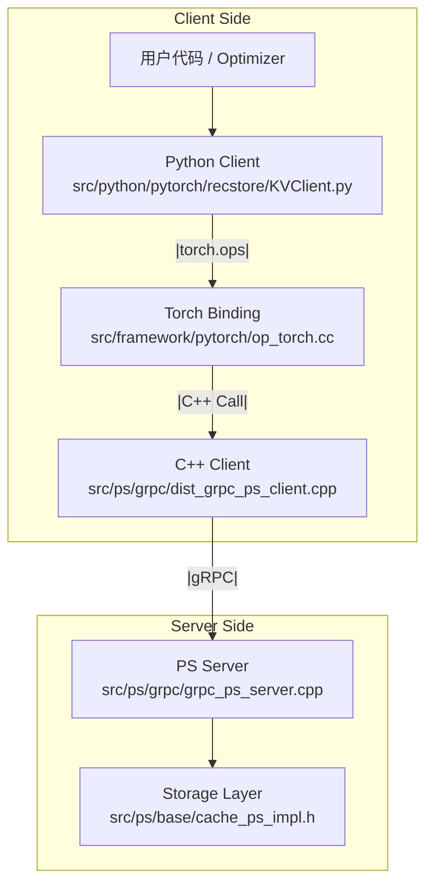

# 如何添加新算子

本文档以 **Optimizer (UpdateParameter)** 为例，介绍如何在 RecStore 中端到端地添加一个新的算子。

## 流程概览



## 0. 设计参数和接口

首先需要设计好一个合理的参数接口，例如对于 `UpdateParameter` 就需要设计：

| 参数名 | 类型 | 说明 |
| --- | --- | --- |
| table_name | string | 表名 |
| ids | tensor | 等待更新的 keys |
| grads | tensor | 对应的梯度 |

## 1. 模型层调用

在最上层，Python 代码通过封装好的 Client 调用底层算子。通常涉及 `KVClient.py` 和具体的业务模块（如 `optimizer.py`）。

???+ note "注意"
    可能需要对输入数据进行一些检查和转换，例如确保 Tensor 在 CPU 上。

### 1.1 KVClient 封装

在 `src/python/pytorch/recstore/KVClient.py` 中，我们加载 C++ 动态库并通过 `torch.ops.recstore_ops` 调用注册好的算子。

```python
# src/python/pytorch/recstore/KVClient.py
class RecStoreClient:
    def __init__(self):
        torch.ops.load_library("lib_recstore_ops.so")
        self.ops = torch.ops.recstore_ops

    # 要添加的算子
    def update(self, name: str, ids: torch.Tensor, grads: torch.Tensor):
        self.ops.emb_update_table(name, ids, grads)
```

### 1.2 业务逻辑调用

在相关代码 (例如 `src/python/pytorch/recstore/optimizer.py` 中)，根据业务需求准备数据并调用 Client。

```python
# src/python/pytorch/recstore/optimizer.py

def _process_generic_module(mod, lr, kv_client):
    all_ids = ...
    all_grads = ...
    
    kv_client.update(name=mod.config_name, ids=all_ids.cpu(), grads=all_grads.cpu())
```

## 2. OP 层实现

OP 层负责连接 Python 和 C++，主要实现在 `src/framework/pytorch/op_torch.cc` 中。它接收 PyTorch Tensor，将其转换为 RecStore 内部的 `RecTensor`，然后调用 C++ Client。

### 2.1 注册 Torch Library

使用 `TORCH_LIBRARY` 宏将 C++ 函数暴露给 Python 层。

```cpp
// src/framework/pytorch/op_torch.cc

TORCH_LIBRARY(recstore_ops, m) {
    // ... 其他算子
    m.def("emb_update_table", emb_update_table_torch);
}
```

### 2.2 实现 Wrapper 函数

编写 Wrapper 函数处理类型检查、数据转换，并转发调用。

```cpp
// src/framework/pytorch/op_torch.cc

void emb_update_table_torch(const std::string& table_name,
                            const torch::Tensor& keys,
                            const torch::Tensor& grads) {
    TORCH_CHECK(keys.scalar_type() == torch::kInt64, "Keys must be int64");
    
    auto op = GetKVClientOp();
    
    base::RecTensor rec_keys = ToRecTensor(keys, base::DataType::UINT64);
    base::RecTensor rec_grads = ToRecTensor(grads, base::DataType::FLOAT32);
    
    op->EmbUpdate(table_name, rec_keys, rec_grads);
}
```

## 3. 客户端接口

在 `src/framework/op.cc` 和 `src/ps/grpc/dist_grpc_ps_client.cpp` 中实现具体的发送逻辑。

### 3.1 暴露 C++ 接口

在 `framework/op.cc` 中，`KVClientOp` 作为 facade，调用具体的 `ps_client_` 实现。

```cpp
// src/framework/op.cc

void KVClientOp::EmbUpdate(const std::string& table_name,
                           const base::RecTensor& keys,
                           const base::RecTensor& grads) {
    // 调用底层的 PS Client
    ps_client_->UpdateParameter(table_name, keys_array, &grads_vector);
}
```

### 3.2 实现 RPC 发送

在 `src/ps/grpc/dist_grpc_ps_client.cpp` 中负责序列化数据并发送网络请求。

```cpp
// src/ps/grpc/dist_grpc_ps_client.cpp

void DistGRPCPSClient::UpdateParameter(const std::string& table_name,
                                       const std::vector<uint64_t>& keys,
                                       const std::vector<float>& grads) {
    // 1. 序列化数据 (例如使用 ParameterCompressor)
    ParameterCompressor compressor;
    // ... 将 keys 和 grads 填入 compressor ...
    
    // 2. 构造 RPC 请求
    UpdateParameterRequest req;
    req.set_table_name(table_name);
    req.set_gradients(compressor.ToByteString());

    // 3. 发送 RPC
    UpdateParameterResponse resp;
    grpc::ClientContext context;
    Status status = stub_->UpdateParameter(&context, req, &resp);
    
    // 4. 处理错误
    if (!status.ok()) { /* Error Handling */ }
}
```

## 4. 协议定义

在开发 Client 和 Server 之前，通常需要先在 `src/ps/proto/ps.proto` 中定义 RPC 接口。

```protobuf
// src/ps/proto/ps.proto

// 定义请求和响应包
message UpdateParameterRequest{
  string table_name = 1;
  optional bytes gradients = 2; // 序列化后的梯度数据
};

message UpdateParameterResponse{
  optional bool success = 1;
};

// 注册 Service 接口
service ParameterService {
  rpc UpdateParameter(UpdateParameterRequest) returns (UpdateParameterResponse);
}
```

## 5. 服务端处理

服务端收到 RPC 请求后，在 `src/ps/grpc/grpc_ps_server.cpp` 中进行解析和分发。

```cpp
// src/ps/grpc/grpc_ps_server.cpp

Status ParameterServiceImpl::UpdateParameter(ServerContext* context, 
                                             const UpdateParameterRequest* request, 
                                             UpdateParameterResponse* reply) {
    // 1. 解析请求参数
    std::string table = request->table_name();
    auto reader = Decode(request->gradients());

    // 2. 调用核心业务逻辑 (CachePS)
    bool success = cache_ps_->UpdateParameter(table, reader, ...);

    // 3. 设置响应
    reply->set_success(success);
    return Status::OK;
}
```

## 6. 存储层逻辑

最后，在 `src/ps/base/cache_ps_impl.h` 中实现具体的存储或计算逻辑。对于 update 操作，这里会调用优化器。

```cpp
// src/ps/base/cache_ps_impl.h

bool CachePS::UpdateParameter(const std::string& table, 
                              const ParameterCompressReader* reader, ...) {
    // 1. 状态检查
    if (!optimizer_) return false;

    // 2. 提取数据
    auto keys = ExtractKeys(reader);
    auto grads = ExtractGrads(reader);

    // 3. 执行核心操作
    optimizer_->Update(table, keys, grads);
    return true;
}
```

## 7. 编写测试

添加完算子后，需要编写单元测试以确保功能正确。推荐在 `src/python/pytorch/recstore/unittest/` 目录下添加 Python 测试用例。

### 7.1 Python 单元测试示例

使用 `unittest` 框架，结合 `ps_server_helper` 可以在测试时自动拉起本地 PS Server。

```python
# src/python/pytorch/recstore/unittest/test_new_op.py

import unittest
import torch
from ..KVClient import get_kv_client

class TestNewOp(unittest.TestCase):
    @classmethod
    def setUpClass(cls):
        cls.kv_client = get_kv_client()

    def test_update_op(self):
        # 1. 准备数据
        table_name = "test_table"
        ids = torch.tensor([1, 2, 3], dtype=torch.int64)
        grads = torch.ones((3, 128), dtype=torch.float32)

        # 2. 初始化 Table (如果需要)
        self.kv_client.ops.init_embedding_table(table_name, 1000, 128)

        # 3. 调用新算子
        self.kv_client.update(table_name, ids, grads)

        # 4. 验证结果
        values = self.kv_client.pull(table_name, ids)
        self.assertTrue(...)
```

### 7.2 运行测试

使用 Python 直接运行测试文件：

```bash
python3 src/python/pytorch/recstore/unittest/test_new_op.py
```

???+ Note 提示
    现有测试 `src/python/pytorch/recstore/unittest/test_dist_emb.py` 包含了完整的 Server 启动/停止逻辑，可供参考。


