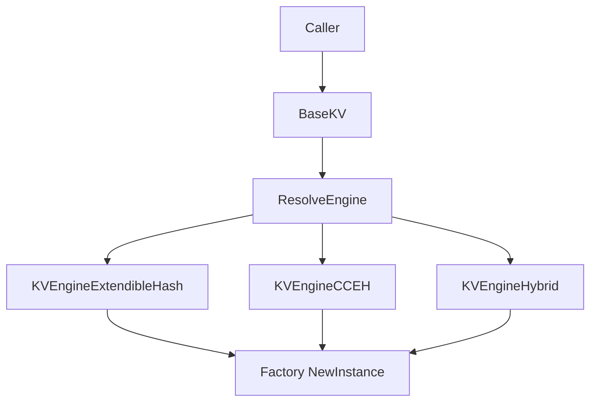
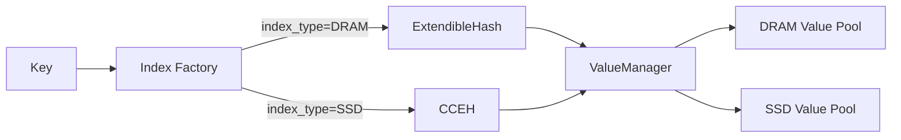
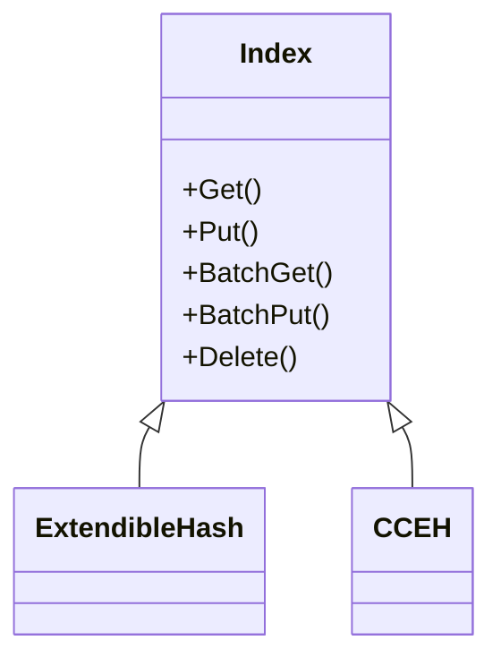

# KVEngine 与 Index 架构概览（当前实现）

本文档描述当前仓库中 KVEngine 及其下层 Index/Value 相关组件的主要关系，帮助快速定位代码与配置语义。

## 1. 顶层路由与实例化

- 选择逻辑：`src/storage/kv_engine/engine_selector.h`
- 注册入口：`src/storage/kv_engine/engine_factory.h`
- 统一接口：`src/storage/kv_engine/base_kv.h`
- 路由条件：
  - `value_type=HYBRID` -> `KVEngineHybrid`
  - `value_type=DRAM/SSD` 且 `index_type=DRAM` -> `KVEngineExtendibleHash`
  - `value_type=DRAM/SSD` 且 `index_type=SSD` -> `KVEngineCCEH`

## 2. 三种 KVEngine 的内部结构

### 2.1 KVEngineExtendibleHash（DRAM 索引）

- 实现：`src/storage/kv_engine/engine_extendible_hash.h`
- 索引实现：`src/storage/dram/extendible_hash.h`
- value 分配器推荐通过 `allocator_type` 选择（`PERSIST_LOOP_SLAB` / `R2_SLAB`，兼容旧字段 `value_memory_management`）
- 常见配置字段：`capacity`, `value_size`, `value_type`, `allocator_type`

### 2.2 KVEngineCCEH（SSD 索引）

- 实现：`src/storage/kv_engine/engine_cceh.h`
- 索引实现：`src/storage/ssd/CCEH.h`
- IO 后端：`src/storage/io_backend/*`（`IOURING` / `SPDK`）
- 必要字段：`io_backend_type`, `queue_cnt`（以及 path/file_path 等）

### 2.3 KVEngineHybrid（Hybrid value）

- 实现：`src/storage/kv_engine/engine_hybridkv.h`
- Value 管理：`src/storage/hybrid/value.h`
- Index 抽象：`src/storage/hybrid/index.h`
- `HYBRID` 模式下会使用 `shmcapacity` + `ssdcapacity` 两层容量配置

## 3. Index 体系

- 抽象基类：`src/storage/hybrid/index.h`
- DRAM 索引实现：`src/storage/dram/extendible_hash.h`
- SSD 索引实现：`src/storage/ssd/CCEH.h`

## 4. 配置字段到组件的映射（当前）

| 字段 | 作用层 | 主要影响 |
|---|---|---|
| `mode` | 路由校验层 | `STATIC` / `DYNAMIC` 组合校验（显式配置时严格） |
| `index_medium` | Engine 选择 / Hybrid 内部 Index 选择 | 推荐新字段；兼容旧字段 `index_type` |
| `value_medium` | Engine 选择 | 推荐新字段；兼容旧字段 `value_type` |
| `index_type` | Engine 选择 / Hybrid 内部 Index 选择 | `DRAM -> ExtendibleHash`, `SSD -> CCEH` |
| `value_type` | Engine 选择 | `HYBRID -> KVEngineHybrid`; `DRAM/SSD` 走非 Hybrid 引擎 |
| `capacity` | 非 Hybrid value 路径 | 结合 `value_size` 决定容量 |
| `value_size` | 非 Hybrid value 路径 | 定长 value 大小 |
| `allocator_type` | value 分配器选择 | 推荐新字段：`PERSIST_LOOP_SLAB` / `R2_SLAB` |
| `value_memory_management` | value 分配器选择 | 兼容旧字段：`PersistLoopShmMalloc` / `R2ShmMalloc` |
| `DRAM_SIZE` | Hybrid value 层 | 推荐新字段；兼容旧字段 `shmcapacity` |
| `SSD_SIZE` | Hybrid value 层 | 推荐新字段；兼容旧字段 `ssdcapacity` |
| `value_layout` | value 布局约束 | `FIXED` / `VARIABLE`，目前 `VARIABLE` 仅 HYBRID 支持 |
| `io_backend_type` | CCEH / IOBackend | `IOURING` 或 `SPDK` |
| `queue_cnt` | CCEH / IOBackend | IO 队列深度/并发能力 |
| `path` / `file_path` | 存储路径 | index/value 文件位置 |

## 5. 与“变长 value”相关的边界

- 当前代码路径里，`ValueManager` 路径（HYBRID）按“长度前缀 + 数据”处理，支持变长 value。
- 非 `ValueManager` 路径大量逻辑依赖 `value_size`，属于定长语义。
- `ResolveEngine` 已增加边界校验：`value_layout=VARIABLE` 时仅允许 HYBRID 路径，避免误用。

## 6. 代码定位清单（快速跳转）

- Engine 路由：`src/storage/kv_engine/engine_selector.h`
- Engine 注册：`src/storage/kv_engine/engine_factory.h`
- ExtendibleHash Engine：`src/storage/kv_engine/engine_extendible_hash.h`
- CCEH Engine：`src/storage/kv_engine/engine_cceh.h`
- Hybrid Engine：`src/storage/kv_engine/engine_hybridkv.h`
- Index 抽象：`src/storage/hybrid/index.h`
- DRAM Index：`src/storage/dram/extendible_hash.h`
- SSD Index：`src/storage/ssd/CCEH.h`
- IOBackend：`src/storage/io_backend/io_backend.h`
- Allocator 公共入口：`src/memory/allocators/allocator_factory.h`
- Slab 分配器封装：`src/memory/allocators/persist_loop_slab_allocator.h`、`src/memory/allocators/r2_slab_allocator.h`
