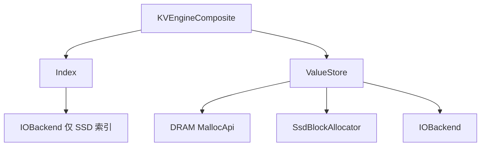

# KVEngineComposite

`KVEngineComposite` 是 RecStore 的**默认** KV 实现：用工厂分别创建 `Index` 与 `ValueStore`，在 `BaseKV` 层完成 Get/Put/BatchGet/BatchPut/BulkLoad 编排。

- 存储层总览：[index.md](./index.md)
- `BaseKV` 与其他 `engine_type`：[basekv.md](./basekv.md)

## 代码入口

| 文件 | 内容 |
|------|------|
| `src/storage/kv_engine/engine_composite.h` | 实现与 `FACTORY_REGISTER` |
| `src/storage/index/` | `Index` 实现 |
| `src/storage/value_store/` | `ValueStore` 实现 |
| `src/storage/io_backend/` | `IOBackend`（SSD value / SSD 索引） |
| `src/memory/allocators/` | DRAM `MallocApi` |
| `src/storage/allocator/ssd/` | SSD slab / buddy |

## 内部分层



**写路径**：`ValueStore::AllocAndWrite` → `Index::Put`（得到旧 handle）→ `ValueStore::Retire(old)`。

**读路径**：`Index::Get` / `BatchGet` → `DirectPtr` 或 `Read` / `BatchRead`。

## 配置骨架

```json
{
  "engine_type": "KVEngineComposite",
  "capacity": 1000000,
  "index": { "type": "DRAM_PET_HASH" },
  "value": {
    "type": "DRAM_VALUE_STORE",
    "default_value_size_hint": 512,
    "path": "/dev/shm/recstore_kv/value",
    "dram_allocator": {
      "type": "CONCURRENT_SLAB_MEMORY_POOL",
      "capacity_bytes": 512000000
    }
  }
}
```

省略 `engine_type` 时，`ResolveEngine` 仍解析为 `KVEngineComposite`。

### 顶层字段

| 字段 | 说明 |
|------|------|
| `capacity` | 必填；索引容量估计，`DRAM_PET_HASH` 用于分配表 |
| `index` | 必填；至少 `index.type` |
| `value` | 必填；至少 `value.type`、`value.default_value_size_hint`，并按类型提供 allocator / path |

字段校验分布在各组件构造函数（如 `DramValueStore` 要求非空 `value.path` 与 `dram_allocator`）。集成测试见 `KVEngineCompositeConfigTest`（`src/test/test_kvengine.cpp`）。

---

## Index（`index.type`）

工厂：`Factory<Index, const BaseKVConfig&>`，注册于 `src/storage/index/`。

| `index.type` | 实现类 | 额外配置 | 说明 |
|--------------|--------|----------|------|
| `DRAM_EXTENDIBLE_HASH` | `DramExtendibleHashIndex` | — | 可扩展 hash；别名 `DRAM` |
| `DRAM_UNORDERED_MAP` | `DramUnorderedMapIndex` | — | `unordered_map` + 读写锁 |
| `DRAM_PET_HASH` | `DramPetHashIndex` | 依赖 `capacity` | PetHash，BatchGet 带 prefetch hint |
| `SSD_EXTENDIBLE_HASH` | `SsdExtendibleHashIndex` | `index.path`、`index.io` | CCEH；别名 `SSD` |
| `SSD` | 同上 | 同上 | 与 `SSD_EXTENDIBLE_HASH` 相同 |

SSD 索引创建 `IOBackend` 前的配置映射：

| 嵌套字段 | 映射到 `BaseKVConfig` |
|----------|------------------------|
| `index.path` | `file_path` |
| `index.io.type` | `io_backend_type`（默认 `IOURING`） |
| `index.io.queue_depth` | `queue_cnt` |
| `index.io.base_offset_bytes / PAGE_SIZE` | `page_id_offset` |

实践上 SSD 索引常与 `SSD_VALUE_STORE` 联调（见 `test_kvengine` 笛卡尔用例对 SSD 组合的 skip 规则）；DRAM 索引与三种 value store 均可组合。

---

## ValueStore（`value.type`）

工厂：`Factory<ValueStore, const BaseKVConfig&>`。

| `value.type` | 实现类 | 说明 |
|--------------|--------|------|
| `DRAM_VALUE_STORE` | `DramValueStore` | 需非空 `value.path`、`value.dram_allocator` |
| `SSD_VALUE_STORE` | `SsdValueStore` | 需非空 `value.path`、`value.ssd_allocator`（含 `io`） |
| `TIERED_VALUE_STORE` | `HybridValueStore` | 需 `dram_allocator` + `ssd_allocator`；无顶层 `value.path` |

### 组合与字段约束

| Index（常见） | `DRAM_VALUE_STORE` | `SSD_VALUE_STORE` | `TIERED_VALUE_STORE` |
|---------------|:------------------:|:-----------------:|:--------------------:|
| DRAM 三类 | 支持 | 支持 | 支持 |
| `SSD` / `SSD_EXTENDIBLE_HASH` | 不推荐 | 支持（测试重点） | 需自行验证 |

| `value.type` | 允许 / 禁止 |
|--------------|-------------|
| `DRAM_VALUE_STORE` | `dram_allocator` 必填；不要 `ssd_allocator` |
| `SSD_VALUE_STORE` | `ssd_allocator` 必填；不要 `dram_allocator`；文件路径仅 `value.path` |
| `TIERED_VALUE_STORE` | 两者必填；SSD 路径在 `ssd_allocator.path`；DRAM 路径可选 `dram_allocator.path`（常为 `/dev/shm/...`） |

**Tiering**：`HybridValueStore` 在 `dram_bytes_reserved + size <= capacity * high_watermark_ratio`（默认 `0.85`）时优先 DRAM，否则 SSD；handle 最高位标记介质。**无后台冷热迁移**。

---

## IOBackend（`*.io.type`）

| `io.type` | 实现 |
|-----------|------|
| `IOURING` | `IoUringBackend` |
| `SPDK` | `SpdkBackend` |

`SsdValueStore`（及 tiered 的 SSD 子配置）映射关系：

| 嵌套字段 | `IOBackend` 字段 |
|----------|------------------|
| `value.path` 或 `ssd_allocator.path` | `file_path` |
| `io.queue_depth` | `queue_cnt` |
| `io.base_offset_bytes / PAGE_SIZE` | `page_id_offset` |
| `io.type` | 工厂名 |

新后端需链接进 `force_link`（见 `kv_engine_register.cc`）。

---

## DRAM Allocator（`value.dram_allocator.type`）

`Factory<MallocApi, const std::string&, int64, const std::string&>`。仓库默认配置使用 **`CONCURRENT_SLAB_MEMORY_POOL`**；若省略 `dram_allocator.type`，`DramValueStore` 在代码中会回退到 **`R2_SLAB`**。

| `type` | 实现 | 别名 |
|--------|------|------|
| `PERSIST_LOOP_SLAB` | `PersistLoopShmMalloc` | `PersistLoopShmMalloc` |
| `R2_SLAB` | `R2alloc` | `R2ShmMalloc` |
| `CONCURRENT_SLAB_MEMORY_POOL` | `ConcurrentSlabMemoryPoolMalloc` | — |
| `PERSIST_MEMORY_POOL` | `PersistMemoryPoolMalloc` | — |

必填：`capacity_bytes`。遗留别名见 `memory/allocators/allocator_factory.h`（如 `PERSIST_LOOP_SHM_MALLOC`）。

---

## SSD Allocator（`value.ssd_allocator.type`）

`SsdValueStore` 内联构造；默认 **`SSD_SLAB`**。

| `type` | 实现 | 主要字段 |
|--------|------|----------|
| `SSD_SLAB` | `SsdSlabAllocator` | `capacity_bytes`；可选 `size_classes`（默认 128…4096）；`base_offset_bytes` |
| `SSD_BUDDY` | `SsdBuddyAllocator` | `capacity_bytes`；`min_block_size` / `max_block_size`；`base_offset_bytes` |

均需嵌套 `io` 对象。

---

## 配置样例

**DRAM + DRAM（仓库默认组合）**

```json
{
  "engine_type": "KVEngineComposite",
  "capacity": 1000000,
  "index": { "type": "DRAM_PET_HASH" },
  "value": {
    "type": "DRAM_VALUE_STORE",
    "default_value_size_hint": 512,
    "path": "/dev/shm/recstore_kv/value",
    "dram_allocator": {
      "type": "CONCURRENT_SLAB_MEMORY_POOL",
      "capacity_bytes": 512000000
    }
  }
}
```

**DRAM + SSD**

```json
{
  "capacity": 1000000,
  "index": { "type": "DRAM_UNORDERED_MAP" },
  "value": {
    "type": "SSD_VALUE_STORE",
    "default_value_size_hint": 512,
    "path": "/data/recstore/value_pages.db",
    "ssd_allocator": {
      "type": "SSD_BUDDY",
      "capacity_bytes": 512000000,
      "min_block_size": 128,
      "max_block_size": 65536,
      "io": {
        "type": "IOURING",
        "queue_depth": 512,
        "base_offset_bytes": 4096
      }
    }
  }
}
```

**DRAM + tiered**

```json
{
  "capacity": 1000000,
  "index": { "type": "DRAM_EXTENDIBLE_HASH" },
  "value": {
    "type": "TIERED_VALUE_STORE",
    "default_value_size_hint": 512,
    "dram_allocator": {
      "type": "PERSIST_LOOP_SLAB",
      "capacity_bytes": 128000000,
      "path": "/dev/shm/recstore_data/tiered_dram"
    },
    "ssd_allocator": {
      "type": "SSD_BUDDY",
      "capacity_bytes": 512000000,
      "path": "/data/recstore/tiered_value_pages.db",
      "min_block_size": 128,
      "max_block_size": 65536,
      "io": {
        "type": "IOURING",
        "queue_depth": 512,
        "base_offset_bytes": 4096
      }
    },
    "tiering": { "high_watermark_ratio": 0.85 }
  }
}
```

**SSD index + SSD value**

```json
{
  "capacity": 1000000,
  "index": {
    "type": "SSD_EXTENDIBLE_HASH",
    "path": "/data/recstore/index_pages.db",
    "io": {
      "type": "IOURING",
      "queue_depth": 512,
      "base_offset_bytes": 0
    }
  },
  "value": {
    "type": "SSD_VALUE_STORE",
    "default_value_size_hint": 512,
    "path": "/data/recstore/value_pages.db",
    "ssd_allocator": {
      "type": "SSD_SLAB",
      "capacity_bytes": 512000000,
      "size_classes": [128, 256, 512, 1024, 4096],
      "io": {
        "type": "IOURING",
        "queue_depth": 512,
        "base_offset_bytes": 4096
      }
    }
  }
}
```

---

## 扩展指南

### 新增 Index

```cpp
void Get(Key_t key, Value_t& pointer, unsigned tid) override;
Value_t Put(Key_t key, Value_t pointer, unsigned tid) override;
void BatchGet(base::ConstArray<Key_t> keys, Value_t* pointers, unsigned tid) override;
void BatchPut(base::ConstArray<Key_t> keys, Value_t* pointers, unsigned tid) override;
bool Delete(Key_t& key) override;
```

未命中返回 `kValueHandleNone`。注册：

```cpp
FACTORY_REGISTER(Index, MY_INDEX, MyIndex, const BaseKVConfig&);
```

在 `test_kvengine` 参数化中增加 `index.type` 组合。

### 新增 ValueStore

实现 `Alloc` / `Write` / `Read` / `Free` / `SlotCapacity`；DRAM 可实现 `DirectPtr`。注册后补充 `test_kvengine` 与配置样例。

### 新增 IOBackend

以 **page** 为单位；实现同步/异步读写、`AllocateBuffer`、完成轮询；能批量提交时覆盖 `BatchReadPages` / `BatchWritePages`。

```cpp
FACTORY_REGISTER(IOBackend, MY_IO, MyIoBackend, const BaseKVConfig&);
```

---

## 修改检查清单

| 改动 | 验证 |
|------|------|
| Index | `ctest -R test_kvengine` |
| ValueStore / DRAM allocator | `test_kvengine` |
| SSD allocator / IO | `test_io_backend` + SSD value 相关 `test_kvengine` |
| 配置校验行为 | `KVEngineCompositeConfigTest` |
| YCSB / 对比 | `.agents/skills/benchmark-kvengine/SKILL.md` |
