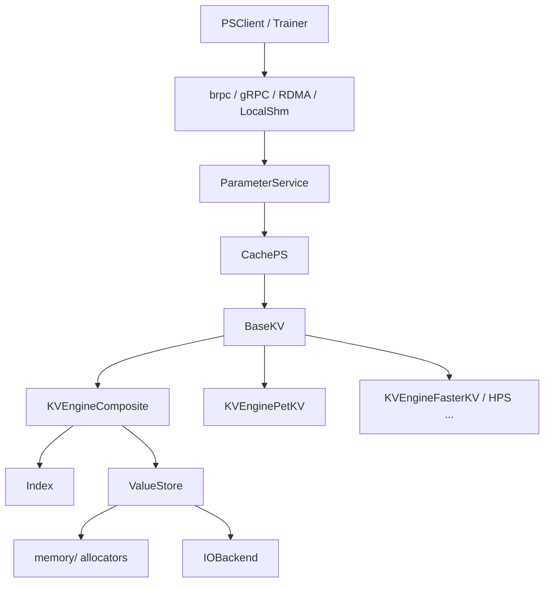

# RecStore 存储层

存储层为参数服务器提供本地键值语义：`uint64_t key -> embedding 字节`。请求由 `CachePS` 经 `BaseKV` 接口下发；具体落盘/落内存策略由 `engine_type` 选择的 KV 引擎决定。

## 在系统中的位置



- **参数服务**（`src/ps/`）：协议、分片、压缩、优化器；不直接操作 `Index` / `ValueStore`。
- **KV 引擎**（`src/storage/kv_engine/`）：实现 `BaseKV`，对外隐藏索引与 value 布局。
- **可组合组件**（`src/storage/index/`、`value_store/`、`io_backend/`、`allocator/`）：主要由 `KVEngineComposite` 组装；也可被测试或后续引擎单独使用。
- **外部与遗留适配**（`src/storage/external/`、`src/storage/nvm/pet_kv/`）：FasterKV、HugeCTR HPS、PetKV 等整包实现。

引擎选择与 `BaseKV` 接口说明见 [basekv.md](./basekv.md)。默认生产路径为 **`KVEngineComposite`**（`DRAM_PET_HASH` + `DRAM_VALUE_STORE` + `CONCURRENT_SLAB_MEMORY_POOL`，见根目录 `recstore_config.json`），组件与配置见 [composite_kvengine.md](./composite_kvengine.md)。

## 代码目录

| 目录 / 文件 | 职责 |
|-------------|------|
| `src/ps/base/cache_ps_impl.h` | 从 `cache_ps.base_kv_config` 构造 `BaseKV` |
| `src/storage/kv_engine/base_kv.h` | `BaseKV` / `BaseKVConfig` 抽象 |
| `src/storage/kv_engine/engine_selector.h` | `ResolveEngine`：`engine_type` 解析 |
| `src/storage/kv_engine/engine_composite.h` | 默认组合引擎 |
| `src/storage/kv_engine/engine_petkv.h` | PetKV 引擎 |
| `src/storage/kv_engine/kv_engine_register.cc` | 链接 IO 后端等注册单元 |
| `src/storage/index/` | `Index`：key → value handle |
| `src/storage/value_store/` | `ValueStore`：handle → 字节 |
| `src/storage/io_backend/` | 页级 SSD 读写（io_uring / SPDK） |
| `src/storage/allocator/ssd/` | SSD slab / buddy |
| `src/memory/allocators/` | DRAM `MallocApi`（PersistLoop、R2 等） |
| `src/storage/external/` | FasterKV、HPS 适配 |

服务端 JSON 字段总表见 [config.md](../config.md) 的 `base_kv_config` 一节。

## CachePS 与 BaseKV

`CachePS` 在构造时读取 `cache_ps` 配置：

```cpp
BaseKVConfig kv_config;
kv_config.num_threads_ = config["num_threads"];
kv_config.json_config_ = config["base_kv_config"];
auto resolved = base::ResolveEngine(kv_config);
base_kv_.reset(base::Factory<BaseKV, const BaseKVConfig&>::NewInstance(
    resolved.engine, resolved.cfg));
```

- `num_threads_` 传入引擎，供批量与组件内部并行使用。
- `json_config_` 原样交给具体引擎；**字段合法性由各引擎及其子组件构造时检查**。
- 省略 `engine_type` 时，`ResolveEngine` 默认 `KVEngineComposite`。

典型调用链：

| CachePS 操作 | BaseKV 方法 |
|--------------|-------------|
| 单条读写 | `Put` / `Get` |
| 批量 embedding | `BatchPut` / `BatchGet` |
| 表初始化 / 优化器 | `optimizer_->Init(..., base_kv_.get())` |
| 清空 | `clear()` |

## KVEngineComposite 读写路径（默认）

写入（`Put` / `BatchPut`）：

1. `CachePS` 收到 key 与 float 数据，调用 `BaseKV::Put` 或 `BatchPut`。
2. `KVEngineComposite` 在 `ValueStore` 上 `AllocAndWrite` 新 slot。
3. `Index::Put` 更新 key 的 handle，返回旧 handle。
4. 对旧 handle 调用 `ValueStore::Retire`（延迟回收）。

读取（`Get` / `BatchGet`）：

1. `Index` 解析 key → handle；未命中为 `kValueHandleNone`，对外表现为空值。
2. 若 `ValueStore::DirectPtr` 可用（DRAM），`BatchGet` 可返回指向底层存储的 `ConstArray<float>` 视图。
3. 否则 `Read` / `BatchRead`（SSD 或 tiered 的 SSD 部分）拷贝到线程局部 buffer。

`BatchPut` 对同一批次内重复 key 会退回逐条 `Put`，避免覆盖顺序不确定。其他引擎的语义以各自实现为准，见 [basekv.md](./basekv.md)。

## 文档索引

| 文档 | 内容 |
|------|------|
| [basekv.md](./basekv.md) | `BaseKV` 接口、工厂创建、全部 `engine_type` 与外部引擎配置 |
| [composite_kvengine.md](./composite_kvengine.md) | `KVEngineComposite` 的 Index / ValueStore / IO / allocator 与扩展指南 |
| [config.md](../config.md) | `recstore_config.json` 中 `base_kv_config` 字段 |

## 验证与基准

| 范围 | 命令 / 位置 |
|------|-------------|
| Composite 组合 | `ctest -R test_kvengine` |
| 外部引擎 | `test_external_kv_engine` / `KVEngineExternalEngineTest`（需对应 CMake 宏） |
| SSD IO | `test_io_backend` |
| YCSB 对比 | `.agents/skills/benchmark-kvengine/SKILL.md` |
